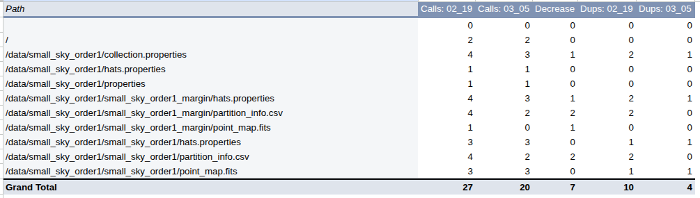

# 2. Cull the Graph

Well, what a let down this is going to be.

My motivation to work on this was the "extra reads" we found a couple months ago.

## Basic file extra reads

The metadata extraneous reads have been addressed by a series of PRs on hats




## Too many parquet reads

Those additional parquet reads were just within the test framework and I was being silly.

e.g.

```
def do_the_tests():
    cone_results = catalog.cone_search(...).compute()
    all_results = catalog.compute() # This was the culprit behind the additional reads
```


