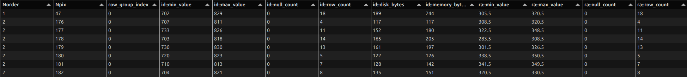
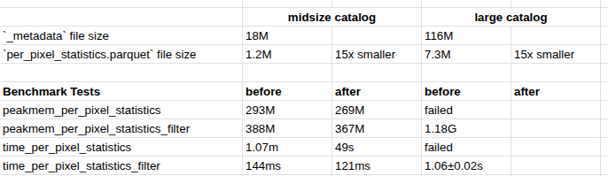

# Can we cache root-level metadata files locally?

https://github.com/astronomy-commons/hats/issues/607

## Feature request

In lieu of (or in addition to?) opening `MOC`, `_metadata`, `_common_metadata` files, try to cache them locally to speed up many remote catalog access patterns.

Or write a different kind of file that would contain the statistics needed for things like `per_pixel_statistics`. The `_metadata` file is unwieldy, slow-to-write, slow-to-read.

## Proof-of-concept

For this week, I tried to implement such a custom metadata cache file.

1. in `write_metadata`, also gather the 6 data points, per column, that we pull in per-pixel-statistics, and write to `per_pixel_statistics.parquet`. parquet is preferred, so types will remain cohesive.
2. in `catalog.per_pixel_statistics`, look for `/catalog/per_pixel_statistics.parquet`. if found, use that to get the stats. otherwise, use slower `_metadata` iteration

Example showing data inside the new file for some unit test data.

## Benchmarking data

We currently have a "midsize catalog" and "large catalog" in our HATS benchmarking data. I created the `per_pixel_statistics.parquet` files, and ran appropriate benchmarks before and after.

This feels ... inconclusive. The speed up is present, but unimpressive. Need to dig more into bottlenecks to see if this is worth pursuing further. 

Otherwise, some kind of filesystem-level caching of those common root-level files should be explored next.