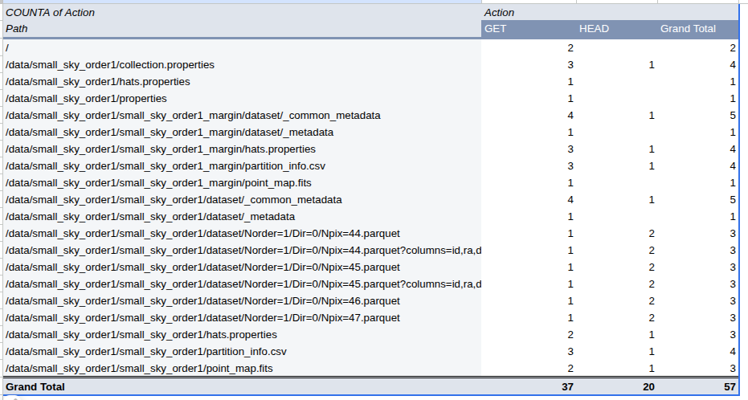
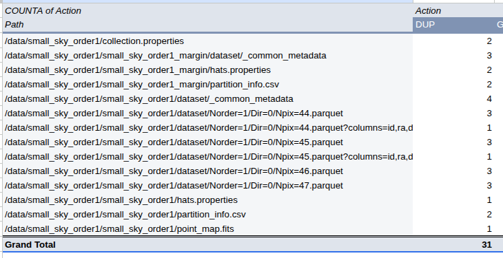

# Debugging number of operations/connections with HTTP

See https://github.com/astronomy-commons/hats-cloudtests/pull/130

- Changed the http internal process to log all requests to a text file.
- Ran a single unit test. `$ pytest --cloud=http -k test_cone_search_filters_correct`
- Look at how very many file requests are happening:

Duplicated or otherwise extraneous GET requests

