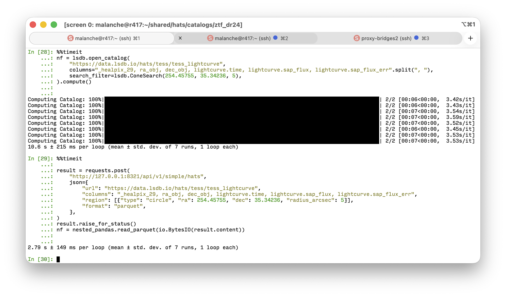
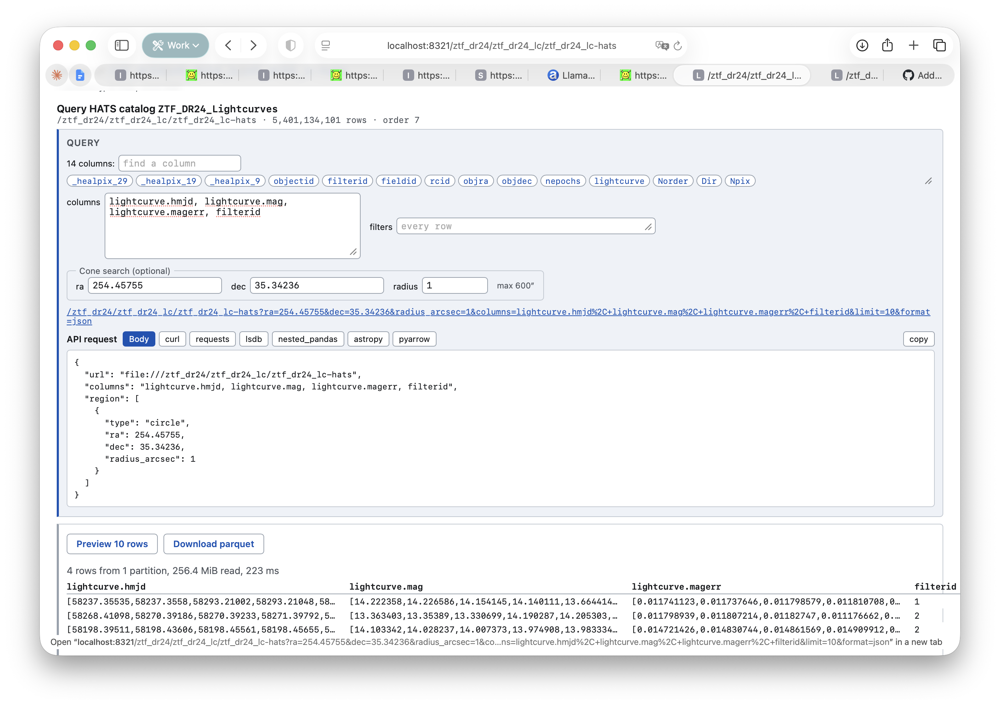
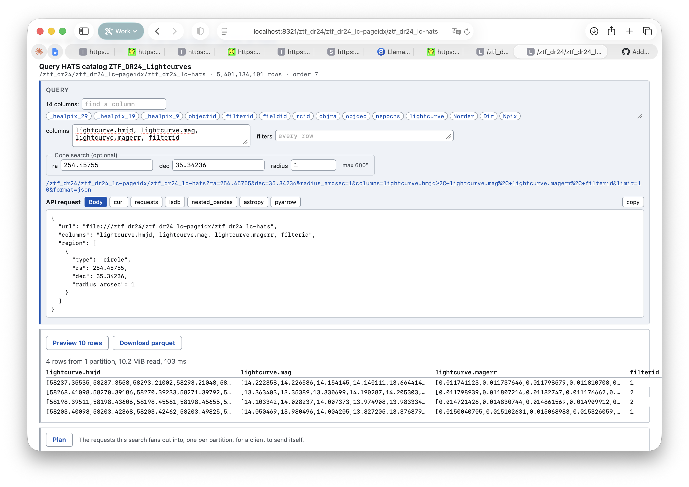

# HATS-API
## Proof-of-Concept web server for HATS

### Problems I'm trying to solve

- Rethink `lsdb-server` with DataFusion, support of spatial queries, and HATS catalogs.
- Provide a "small query" HATS API server for both local and remote storage.
- Provide a "small query" TAP implementation above HATS.

### Problems I'm not trying to solve

- Replace LSDB

### Current interface

- `/`: File server, e.g. `lsdb-server` replacement. See CMU-hosted <https://hats.homb.it>
- `/api/v1/simple/hats`, `/api/v1/simple/hats`, `/api/v1/simple/hats/plan`: similar functionality, but different API interface (POST with JSON body) and supports remote URLs.
- `/api/v1/adql`: ADQL via POST with JSON body, supports remote URLs.
- (Almost there) `/api/v1/tap`: TAP with sync ADQL, works vs pre-configured list of catalogs only.

See [`/api/v1/docs`](https://hats.homb.it/api/v1/docs) for auto-generated OpenAPI documentation.

### Is it ready to replace Apache at Epyc for data.lsdb.io?

Not yet. It is still faster to get a small number of columns directly.

From LSDB's perspective we shouldn't set `?columns=...` when querying HATS API, column pruning with a static web server and smart client should be cheaper.

### Benchmarks

#### Versus "native" APIs

I've selected a single light curve from a "native" API vs HATS API. Native APIs are queried by object ID only, HATS API is queried by both small cone search and object ID.

- Gaia Epoch Photometry, TAP DataLink via `astroquery` **2.2s** vs HATS API (network data) **4.2s** vs HATS API (local data) **0.26s**.
- PS1 DR2 Detection, MAST API **0.16s** vs HATS API (network data) **1.5s**.

#### Versus LSDB

- Local Gaia DR3, cross-match vs 288-row catalog: LSDB **20s** vs HATS API **15s**.
- Remote TESS light curves with nested column projection: LSDB **10.6s** vs HATS API **2.8s**.

### Bonus: page index

I've added parquet page index to ZTF DR24 light curve catalog, HATS API is able to reduce loading size by the factor of x20 for a realistic small cone search.

Without page index (256.4 MiB read):

With page index (10.2 MiB read):

